### LINUX忘记密码处理

- 重启服务器

在进入这个界面按下`e` 键。

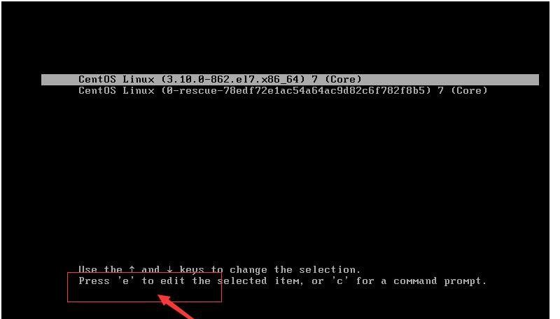

接着，进入编辑界面，使用键盘上的上下键把光标往下移动，找到以““Linux16”开头内容所在的行数”，在行的最后面输入：`init=/bin/sh`。如图：

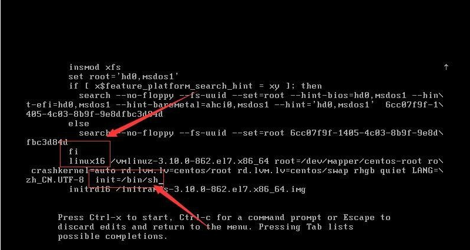

接着，输入完成后，直接按快捷键：`Ctrl+x`  进入单用户模式。如图：

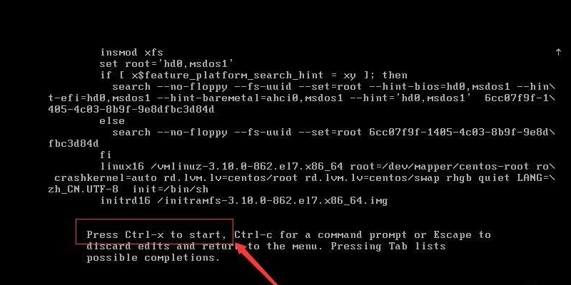

接着，在进入新的编辑界面中，在最后面输入“ls”，完成后按键盘的回车键（Enter）。如图：

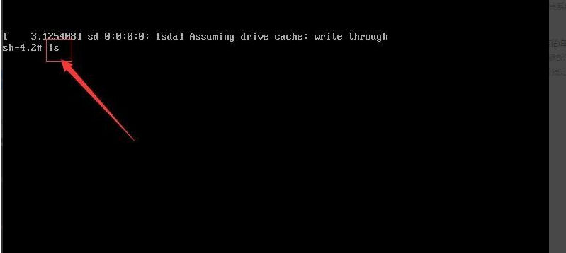

接着，在光标闪烁的位置中（最后一行的位置）输入：mount -o remount,rw /（注意：mount与－o之间有空格以及rw与/之间也有空格，不能省略），完成后按键盘的回车键（Enter）。如图：

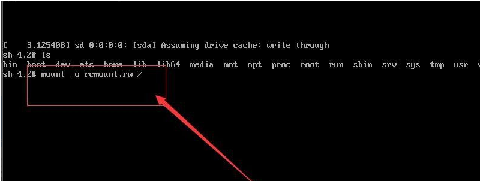

接着，在新的一行最后面输入：passwd， 完成后按键盘的回车键（Enter）。如如图;

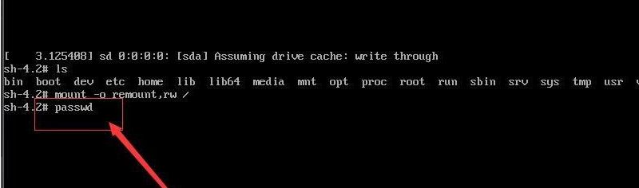

接着，在弹出的内容中就是修改密码的操作了，在光标闪烁的位置输入新的密码（密码在输入的时候是不显示的，就像没反应一样，只需要记住自己输入的密码是正确的就可以了，密码必须是不少于8位，否则会修改失败）， 完成后按键盘的回车键（Enter）。如图：

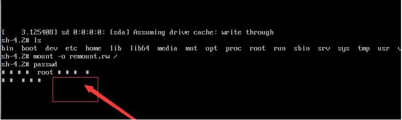

接着，再一次输入刚输入设置的密码。如图：

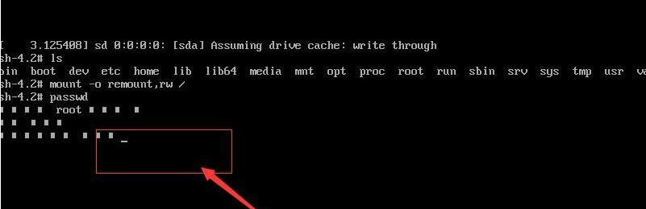

接着，密码修改成功后，会显示passwd.....的样式，说明密码修改成功。如图：

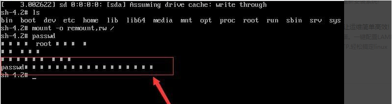

接着，在鼠标闪烁的位置中（最后一行中）输入：touch /.autorelabel（注意：touch与 /后面有一个空格），完成后按键盘的回车键（Enter）。如图：

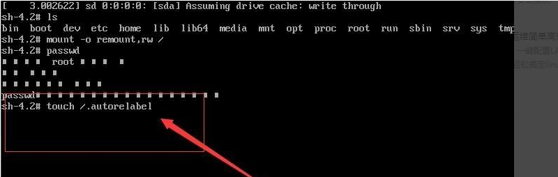

接着，继续在光标闪烁的位置中，输入：exec /sbin/init（注意：exec与 /后面有一个空格），完成后按键盘的回车键（Enter）。如图：

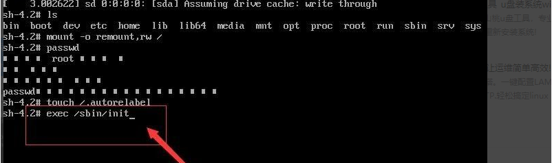

接着，等待系统自动修改密码，完成后，系统会自动重启。报错不用管 等着就行了 如图：

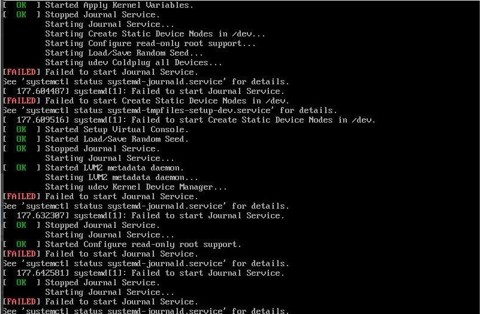

等待启动后  输入刚才更改的密码修改密码即可  

至此密码重置成功！