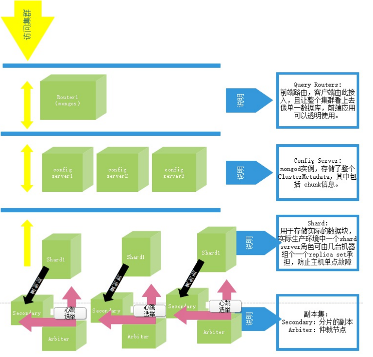

## MongoDB集群环境部署演示

- 素材准备

  由于本次项目部署采用docker编排部署，素材提供了当前目录下的`docker-composer.yaml` 文件和 `mongodb.sh` 文件

  架构图

  

- 执行步骤

  > 首先我们看一下 `docker-composer.yaml` 文件里的内容

  ```shell
  version: '3.6'
  services:
    # --------------- A ----------------
    mongos_shard_A_174_2:
      image: mongo:4.0.0
      container_name: mongos_shard_A_174_2
      expose:
        - 27018
      # --shardsvr: 这个参数仅仅只是将默认的27017端口改为27018,如果指定--port参数，可用不需要这个参数
      # --directoryperdb：每个数据库使用单独的文件夹
      # --replSet：定义是副本集分片
      # shard_A 这是代表整个分片的名称
      command: mongod --shardsvr --directoryperdb --replSet shard_A
      volumes:
        - /etc/localtime:/etc/localtime
        - /www/wwwroot/dockerData/mongodb/A/174_2:/data/db
      privileged: true
      # 必须要配置容器内存大小，不然mongodb可能会吃光内存
      # 1G => 1024mb  1mb =>1024kb 1kb => 1024bt
      deploy:
        resources:
          limits:
             memory: 1G
      networks: ## 引入外部预先定义的网段
        mongo:
           ipv4_address: 174.200.7.2   #设置ip地址
  
    mongos_secondary_A_174_3:
      image: mongo:4.0.0
      container_name: mongos_secondary_A_174_3
      expose:
        - 27018
      command: mongod --shardsvr --directoryperdb --replSet shard_A
      volumes:
        - /etc/localtime:/etc/localtime
        - /www/wwwroot/dockerData/mongodb/A/174_3:/data/db
      privileged: true
      deploy:
        resources:
           limits:
              memory: 1G
      networks: ## 引入外部预先定义的网段
        mongo:
           ipv4_address: 174.200.7.3   #设置ip地址
  
    mongos_arbiter_A_174_4:
      image: mongo:4.0.0
      container_name: mongos_arbiter_A_174_4
      expose:
        - 27018
      command: mongod --shardsvr --directoryperdb --replSet shard_A
      volumes:
        - /etc/localtime:/etc/localtime
        - /www/wwwroot/dockerData/mongodb/A/174_4:/data/db
      privileged: true
      deploy:
        resources:
           limits:
              memory: 1G
      networks: ## 引入外部预先定义的网段
        mongo:
           ipv4_address: 174.200.7.4   #设置ip地址
  
    # ----------- B --------------------
  
    mongos_shard_B_174_6:
      image: mongo:4.0.0
      container_name: mongos_shard_B_174_6
      expose:
        - 27018
      command: mongod --shardsvr --directoryperdb --replSet shard_B
      volumes:
        - /etc/localtime:/etc/localtime
        - /www/wwwroot/dockerData/mongodb/B/174_6:/data/db
      privileged: true
      deploy:
        resources:
           limits:
              memory: 1G
      networks: ## 引入外部预先定义的网段
        mongo:
           ipv4_address: 174.200.7.6   #设置ip地址
  
    mongos_secondary_B_174_7:
      image: mongo:4.0.0
      container_name: mongos_secondary_B_174_7
      expose:
        - 27018
      command: mongod --shardsvr --directoryperdb --replSet shard_B
      volumes:
        - /etc/localtime:/etc/localtime
        - /www/wwwroot/dockerData/mongodb/B/174_7:/data/db
      privileged: true
      deploy:
        resources:
           limits:
              memory: 1G
      networks: ## 引入外部预先定义的网段
        mongo:
           ipv4_address: 174.200.7.7   #设置ip地址
  
    mongos_arbiter_B_174_8:
      image: mongo:4.0.0
      container_name: mongos_arbiter_B_174_8
      expose:
        - 27018
      command: mongod --shardsvr --directoryperdb --replSet shard_B
      volumes:
        - /etc/localtime:/etc/localtime
        - /www/wwwroot/dockerData/mongodb/B/174_8:/data/db
      privileged: true
      deploy:
        resources:
           limits:
              memory: 1G
      networks: ## 引入外部预先定义的网段
        mongo:
           ipv4_address: 174.200.7.8   #设置ip地址
  
    # ---- config -----
    mongo_config_174_10:
      image: mongo:4.0.0
      container_name: mongo_config_174_10
      expose:
        - 27019
      # --configsvr: 这个参数仅仅是将默认端口由27017改为27019, 如果指定--port可不添加该参数
      # fates-mongo-config: 这是配置服务器集群的名称
      # --smallfiles: 代表是一个数据库一个文件
      command: mongod --configsvr --directoryperdb --replSet fates-mongo-config --smallfiles
      volumes:
        - /etc/localtime:/etc/localtime
        - /www/wwwroot/dockerData/mongodb/config/174_10:/data/configdb
      depends_on:
        - mongos_shard_A_174_2
        - mongos_secondary_A_174_3
        - mongos_arbiter_A_174_4
        - mongos_shard_B_174_6
        - mongos_secondary_B_174_7
        - mongos_arbiter_B_174_8
      networks: ## 引入外部预先定义的网段
        mongo:
           ipv4_address: 174.200.7.10   #设置ip地址
    mongo_config_174_20:
      image: mongo:4.0.0
      container_name: mongo_config_174_20
      expose:
        - 27019
      command: mongod --configsvr --directoryperdb --replSet fates-mongo-config --smallfiles
      volumes:
        - /etc/localtime:/etc/localtime
        - /www/wwwroot/dockerData/mongodb/config/174_20:/data/configdb
      depends_on:
        - mongos_shard_A_174_2
        - mongos_secondary_A_174_3
        - mongos_arbiter_A_174_4
        - mongos_shard_B_174_6
        - mongos_secondary_B_174_7
        - mongos_arbiter_B_174_8
      networks: ## 引入外部预先定义的网段
        mongo:
           ipv4_address: 174.200.7.20   #设置ip地址
  
    # ----- route ------
    # mongodb:27017
    # route:27017
    # config:27019
    # arbiter-secondary-shard:27018
   
    mongos_route_174_200:
      image: mongo:4.0.0
      container_name: mongos_route_174_200
      # mongo3.6版默认绑定IP为127.0.0.1，此处绑定0.0.0.0是允许其他容器或主机可以访问
      command: mongos --configdb fates-mongo-config/174.200.7.20:27019,174.200.7.10:27019 --bind_ip 0.0.0.0 --port 27017
      ports:
        - 27017:27017
      volumes:
        - /etc/localtime:/etc/localtime
      depends_on:
        - mongo_config_174_10
        - mongo_config_174_20
      networks: ## 引入外部预先定义的网段
        mongo:
           ipv4_address: 174.200.7.200   #设置ip地址
  networks:
    mongo:
      driver: bridge
      ipam: #定义网段
        config:
          - subnet: "174.200.7.0/24"
  
  ```

  > 其次我们看下 `mongodb.sh` 中的内容

  ```shell
  # ! /bin/sh
  docker-compose --compatibility up -d
  
  echo -e "sleep 60s start\n"
  # 设置休眠的目的是让容器中的服务能够正常起来
  sleep 60s;
  
  echo -e "sleep 60s end \n"
  
  docker exec -it mongo_config_174_20 bash -c "echo 'rs.initiate({_id: \"fates-mongo-config\",configsvr: true, members: [{ _id : 0, host : \"174.200.7.10:27019\" },{ _id : 1, host : \"174.200.7.20:27019\" }]})' | mongo --port 27019";
  # 设置短暂休眠的目的是让命令执行后停一下 确保所有命令执行成功
  # 不然可能会报错
  sleep 5s;
  
  docker exec -it mongos_shard_A_174_2 bash -c "echo 'rs.initiate({_id: \"shard_A\",members: [{ _id : 10, host : \"174.200.7.2:27018\" },{ _id : 11, host : \"174.200.7.3:27018\" },{ _id : 12, host : \"174.200.7.4:27018\", arbiterOnly: true }]})' | mongo --port 27018";
  
  sleep 5s;
  
  docker exec -it mongos_shard_B_174_6 bash -c "echo 'rs.initiate({_id: \"shard_B\",members: [{ _id : 10, host : \"174.200.7.6:27018\" },{ _id : 11, host : \"174.200.7.7:27018\" },{ _id : 12, host : \"174.200.7.8:27018\", arbiterOnly: true }]})' | mongo --port 27018";
  
  sleep 5s;
  
  docker exec -it mongos_route_174_200 bash -c "echo 'sh.addShard(\"shard_A/174.200.7.2:27018,174.200.7.3:27018,174.200.7.4:27018\")' | mongo";
  
  sleep 5s;
  
  docker exec -it mongos_route_174_200 bash -c "echo 'sh.addShard(\"shard_B/174.200.7.6:27018,174.200.7.7:27018,174.200.7.8:27018\")' | mongo"
  
  ```

  > 操作步骤

  ```shell
  ###将上面两个文件`docker-composer.yaml` 和`mongodb.sh`上传至服务器指定目录，我的上传在`mongodb_cluster`目录下，你们请随便
  [root@yzj5502019109537-1222139 mongodb]# cd mongodb_cluster/
  [root@yzj5502019109537-1222139 mongodb_cluster]# ll
  total 12
  -rw-r--r-- 1 root root 6041 Sep 10 21:21 docker-compose.yaml
  -rw-r--r-- 1 root root 1167 Sep 10 21:35 mongodb.sh
  ###执行脚本
  [root@yzj5502019109537-1222139 mongodb_cluster]# chmod +x mongodb.sh 
  [root@yzj5502019109537-1222139 mongodb_cluster]# ./mongodb.sh 
  Creating network "mongodb_cluster_mongo" with driver "bridge"
  Pulling mongos_shard_A_174_2 (mongo:4.0.0)...
  4.0.0: Pulling from library/mongo
  8ee29e426c26: Pull complete
  6e83b260b73b: Pull complete
  e26b65fd1143: Pull complete
  40dca07f8222: Pull complete
  b420ae9e10b3: Pull complete
  f60a3ef68cf9: Pull complete
  4a9eeb4f5b1b: Pull complete
  2b2f33f1e783: Pull complete
  dbadcc13ac8f: Pull complete
  a532ead5a592: Pull complete
  9eb4e7f96a46: Pull complete
  c86ad25ed52c: Pull complete
  b781e8198b7b: Pull complete
  0472a3a2c747: Pull complete
  Digest: sha256:fe6f2489e9e54fc1205b32e991f77e4326689319428c51cfbdb9d69fef2d854f
  Status: Downloaded newer image for mongo:4.0.0
  Creating mongos_secondary_B_174_7 ... done
  Creating mongos_secondary_A_174_3 ... done
  ###.......省略很多无效内容
  exception: connect failed
  MongoDB shell version v4.0.0
  connecting to: mongodb://127.0.0.1:27017
  2020-09-12T12:58:19.946+0800 E QUERY    [js] Error: couldn't connect to server 127.0.0.1:27017, connection attempt failed: SocketException: Error connecting to 127.0.0.1:27017 :: caused by :: Connection refused :
  connect@src/mongo/shell/mongo.js:251:13
  @(connect):1:6
  exception: connect failed
  ####这个就是脚本中的sleep时间不够导致的，这个时间是根据你机器###配置来的配置高的可能很快。出现这种情况我们就要停止容器，调整###sleep参数再次操作。
  [root@yzj5502019109537-1222139 mongodb_cluster]# docker-compose down
  WARNING: Some services (mongos_arbiter_A_174_4, mongos_arbiter_B_174_8, mongos_secondary_A_174_3, mongos_secondary_B_174_7, mongos_shard_A_174_2, mongos_shard_B_174_6) use the 'deploy' key, which will be ignored. Compose does not support 'deploy' configuration - use `docker stack deploy` to deploy to a swarm.
  Stopping mongos_route_174_200     ... done
  Stopping mongo_config_174_10      ... done
  Stopping mongo_config_174_20      ... done
  Stopping mongos_shard_B_174_6     ... done
  Stopping mongos_secondary_A_174_3 ... done
  Stopping mongos_arbiter_A_174_4   ... done
  Stopping mongos_shard_A_174_2     ... done
  Stopping mongos_secondary_B_174_7 ... done
  Stopping mongos_arbiter_B_174_8   ... done
  Removing mongos_route_174_200     ... done
  Removing mongo_config_174_10      ... done
  Removing mongo_config_174_20      ... done
  Removing mongos_shard_B_174_6     ... done
  Removing mongos_secondary_A_174_3 ... done
  Removing mongos_arbiter_A_174_4   ... done
  Removing mongos_shard_A_174_2     ... done
  Removing mongos_secondary_B_174_7 ... done
  Removing mongos_arbiter_B_174_8   ... done
  Removing network mongodb_cluster_mongo
  [root@yzj5502019109537-1222139 mongodb_cluster]# ./mongodb.sh 
  Creating network "mongodb_cluster_mongo" with driver "bridge"
  Creating mongos_secondary_B_174_7 ... done
  Creating mongos_arbiter_B_174_8   ... done
  Creating mongos_shard_A_174_2     ... done
  Creating mongos_shard_B_174_6     ... done
  Creating mongos_arbiter_A_174_4   ... done
  Creating mongos_secondary_A_174_3 ... done
  Creating mongo_config_174_20      ... done
  Creating mongo_config_174_10      ... done
  Creating mongos_route_174_200     ... done
  sleep 60s start
  
  sleep 60s end 
  
  MongoDB shell version v4.0.0
  connecting to: mongodb://127.0.0.1:27019/
  ####。。。。。此处省略很多
  bye
  MongoDB shell version v4.0.0
  connecting to: mongodb://127.0.0.1:27017
  MongoDB server version: 4.0.0
  {
  	"shardAdded" : "shard_B",
  	"ok" : 1,
  	"operationTime" : Timestamp(1599887150, 1),
  	"$clusterTime" : {
  		"clusterTime" : Timestamp(1599887151, 1),
  		"signature" : {
  			"hash" : BinData(0,"AAAAAAAAAAAAAAAAAAAAAAAAAAA="),
  			"keyId" : NumberLong(0)
  		}
  	}
  }
  bye
  ###这才是构建成功的最后提示成功后我们可以通过docker ps 查看一
  ###下容器 构建成功的效果如下
  [root@yzj5502019109537-1222139 mongodb_cluster]# docker ps
  CONTAINER ID        IMAGE               COMMAND                  CREATED             STATUS              PORTS                      NAMES
  c05d126cbc37        mongo:4.0.0         "docker-entrypoint.s…"   36 minutes ago      Up 36 minutes       0.0.0.0:27017->27017/tcp   mongos_route_174_200
  9e1381304382        mongo:4.0.0         "docker-entrypoint.s…"   36 minutes ago      Up 36 minutes       27017/tcp, 27019/tcp       mongo_config_174_20
  14b313100c79        mongo:4.0.0         "docker-entrypoint.s…"   36 minutes ago      Up 36 minutes       27017/tcp, 27019/tcp       mongo_config_174_10
  e3f50882ca44        mongo:4.0.0         "docker-entrypoint.s…"   36 minutes ago      Up 36 minutes       27017-27018/tcp            mongos_secondary_A_174_3
  a3fee67e7bb6        mongo:4.0.0         "docker-entrypoint.s…"   36 minutes ago      Up 36 minutes       27017-27018/tcp            mongos_shard_B_174_6
  58c7438ed108        mongo:4.0.0         "docker-entrypoint.s…"   36 minutes ago      Up 36 minutes       27017-27018/tcp            mongos_arbiter_A_174_4
  8df199590d7d        mongo:4.0.0         "docker-entrypoint.s…"   36 minutes ago      Up 36 minutes       27017-27018/tcp            mongos_arbiter_B_174_8
  0d6b6754016f        mongo:4.0.0         "docker-entrypoint.s…"   36 minutes ago      Up 36 minutes       27017-27018/tcp            mongos_shard_A_174_2
  7207d01b45ca        mongo:4.0.0         "docker-entrypoint.s…"   36 minutes ago      Up 36 minutes       27017-27018/tcp            mongos_secondary_B_174_7
  ###通过进入mongodb
  [root@yzj5502019109537-1222139 mongodb_cluster]# docker exec -it mongos_route_174_200 bash
  
  
  
  
  ```

  

- 问题处理
> 问题描述
```shell
bye
MongoDB shell version v4.0.0
connecting to: mongodb://127.0.0.1:27017
2020-09-12T12:58:19.695+0800 E QUERY    [js] Error: couldn't connect to server 127.0.0.1:27017, connection attempt failed: SocketException: Error connecting to 127.0.0.1:27017 :: caused by :: Connection refused :
connect@src/mongo/shell/mongo.js:251:13
@(connect):1:6
exception: connect failed
MongoDB shell version v4.0.0
connecting to: mongodb://127.0.0.1:27017
2020-09-12T12:58:19.946+0800 E QUERY    [js] Error: couldn't connect to server 127.0.0.1:27017, connection attempt failed: SocketException: Error connecting to 127.0.0.1:27017 :: caused by :: Connection refused :
connect@src/mongo/shell/mongo.js:251:13
@(connect):1:6
exception: connect failed
[root@yzj5502019109537-1222139 mongodb_cluster]#

```
1、出现如下问题，可以设置增加 `mongodb.sh` 中的sleep时间,然后重新构建环境

```shell
###延长mongodb.sh中的sleep参数后停止停止编排容器
[root@yzj5502019109537-1222139 mongodb_cluster]# docker-compose down
WARNING: Some services (mongos_arbiter_A_174_4, mongos_arbiter_B_174_8, mongos_secondary_A_174_3, mongos_secondary_B_174_7, mongos_shard_A_174_2, mongos_shard_B_174_6) use the 'deploy' key, which will be ignored. Compose does not support 'deploy' configuration - use `docker stack deploy` to deploy to a swarm.
Removing network mongodb_cluster_mongo
WARNING: Network mongodb_cluster_mongo not found.
[root@yzj5502019109537-1222139 mongodb_cluster]# docker ps
CONTAINER ID        IMAGE               COMMAND             CREATED             STATUS              PORTS               NAMES
###修改后重新构建
[root@yzj5502019109537-1222139 mongodb_cluster]# ./mongodb.sh 
Creating network "mongodb_cluster_mongo" with driver "bridge"
Creating mongos_secondary_B_174_7 ... done
Creating mongos_arbiter_B_174_8   ... done
Creating mongos_shard_A_174_2     ... done
Creating mongos_secondary_A_174_3 ... done
Creating mongos_arbiter_A_174_4   ... done
Creating mongos_shard_B_174_6     ... done
Creating mongo_config_174_10      ... done
Creating mongo_config_174_20      ... done
Creating mongos_route_174_200     ... done
sleep 60s start

sleep 60s end 

```


2、还可以将 `mongodb.sh` 中的后五段内容单独执行即可
```shell
[root@yzj5502019109537-1222139 mongodb_cluster]# docker exec -it mongos_shard_A_174_2 bash -c "echo 'rs.initiate({_id: \"shard_A\",members: [{ _id : 10, host : \"174.200.7.2:27018\" },{ _id : 11, host : \"174.200.7.3:27018\" },{ _id : 12, host : \"174.200.7.4:27018\", arbiterOnly: true }]})' | mongo --port 27018"
MongoDB shell version v4.0.0
connecting to: mongodb://127.0.0.1:27018/
MongoDB server version: 4.0.0
{
	"operationTime" : Timestamp(1599886810, 1),
	"ok" : 0,
	"errmsg" : "already initialized",
	"code" : 23,
	"codeName" : "AlreadyInitialized",
	"$clusterTime" : {
		"clusterTime" : Timestamp(1599886810, 1),
		"signature" : {
			"hash" : BinData(0,"AAAAAAAAAAAAAAAAAAAAAAAAAAA="),
			"keyId" : NumberLong(0)
		}
	}
}
bye
[root@yzj5502019109537-1222139 mongodb_cluster]# docker exec -it mongos_shard_B_174_6 bash -c "echo 'rs.initiate({_id: \"shard_B\",members: [{ _id : 10, host : \"174.200.7.6:27018\" },{ _id : 11, host : \"174.200.7.7:27018\" },{ _id : 12, host : \"174.200.7.8:27018\", arbiterOnly: true }]})' | mongo --port 27018"
MongoDB shell version v4.0.0
connecting to: mongodb://127.0.0.1:27018/
MongoDB server version: 4.0.0
{
	"operationTime" : Timestamp(1599886822, 1),
	"ok" : 0,
	"errmsg" : "already initialized",
	"code" : 23,
	"codeName" : "AlreadyInitialized",
	"$clusterTime" : {
		"clusterTime" : Timestamp(1599886822, 1),
		"signature" : {
			"hash" : BinData(0,"AAAAAAAAAAAAAAAAAAAAAAAAAAA="),
			"keyId" : NumberLong(0)
		}
	}
}
bye
[root@yzj5502019109537-1222139 mongodb_cluster]# docker exec -it mongos_route_174_200 bash -c "echo 'sh.addShard(\"shard_A/174.200.7.2:27018,174.200.7.3:27018,174.200.7.4:27018\")' | mongo"
MongoDB shell version v4.0.0
connecting to: mongodb://127.0.0.1:27017
MongoDB server version: 4.0.0
{
	"shardAdded" : "shard_A",
	"ok" : 1,
	"operationTime" : Timestamp(1599886834, 6),
	"$clusterTime" : {
		"clusterTime" : Timestamp(1599886834, 6),
		"signature" : {
			"hash" : BinData(0,"AAAAAAAAAAAAAAAAAAAAAAAAAAA="),
			"keyId" : NumberLong(0)
		}
	}
}
bye
[root@yzj5502019109537-1222139 mongodb_cluster]# docker exec -it mongos_route_174_200 bash -c "echo 'sh.addShard(\"shard_B/174.200.7.6:27018,174.200.7.7:27018,174.200.7.8:27018\")' | mongo"
MongoDB shell version v4.0.0
connecting to: mongodb://127.0.0.1:27017
MongoDB server version: 4.0.0
{
	"shardAdded" : "shard_B",
	"ok" : 1,
	"operationTime" : Timestamp(1599886843, 5),
	"$clusterTime" : {
		"clusterTime" : Timestamp(1599886843, 5),
		"signature" : {
			"hash" : BinData(0,"AAAAAAAAAAAAAAAAAAAAAAAAAAA="),
			"keyId" : NumberLong(0)
		}
	}
}
bye

```

- 操作演示
```shell
###登录容器
[root@yzj5502019109537-1222139 mongodb_cluster]# docker exec -it mongos_route_174_200 bash
root@c05d126cbc37:/# mongo
MongoDB shell version v4.0.0
connecting to: mongodb://127.0.0.1:27017
MongoDB server version: 4.0.0
Welcome to the MongoDB shell.
For interactive help, type "help".
For more comprehensive documentation, see
	http://docs.mongodb.org/
Questions? Try the support group
	http://groups.google.com/group/mongodb-user
Server has startup warnings: 
2020-09-12T13:04:33.786+0800 I CONTROL  [main] 
2020-09-12T13:04:33.786+0800 I CONTROL  [main] ** WARNING: Access control is not enabled for the database.
2020-09-12T13:04:33.786+0800 I CONTROL  [main] **          Read and write access to data and configuration is unrestricted.
2020-09-12T13:04:33.786+0800 I CONTROL  [main] 
###查看同期数据库 具体操作可以参看下方注释处【MongoDB使用说明】
mongos> show dbs;
admin   0.000GB
config  0.001GB
mongos> use test
switched to db test
mongos> show dbs;
admin   0.000GB
config  0.001GB
mongos> db.test.insert({name:"wangxiaob",age:33});
WriteResult({ "nInserted" : 1 })
mongos> show tables;
test
mongos> show dbs;
admin   0.000GB
config  0.001GB
test    0.000GB
mongos> db.test.insert({name:"royeecai",age:26});
WriteResult({ "nInserted" : 1 })
mongos> db.test.find();
{ "_id" : ObjectId("5f5c58cf5134daa9a16f7dd1"), "name" : "wangxiaob", "age" : 33 }
{ "_id" : ObjectId("5f5c59055134daa9a16f7dd2"), "name" : "royeecai", "age" : 26 }
mongos> db.test.findOne();
{
	"_id" : ObjectId("5f5c58cf5134daa9a16f7dd1"),
	"name" : "wangxiaob",
	"age" : 33
}
mongos> ^C
bye
root@c05d126cbc37:/# exit

```
注：[MongoDB使用说明](https://blog.csdn.net/Qcg0223/article/details/103781003)

***
> ### 我们江湖再见。。。。
