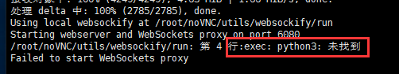

## NoVNC环境部署

- **下载源码***

git clone https://github.com/novnc/noVNC.git

- **创建安全连接(一路回车)**

  cd ./noVNC/utils/
  openssl req -new -x509 -days 365 -nodes -out self.pem -keyout self.pem

- 运行noVNC

  ./utils/launch.sh  --vnc 192.168.17.152:5901

  

  如果提示请安装python3

  yum -y install python3

  

  