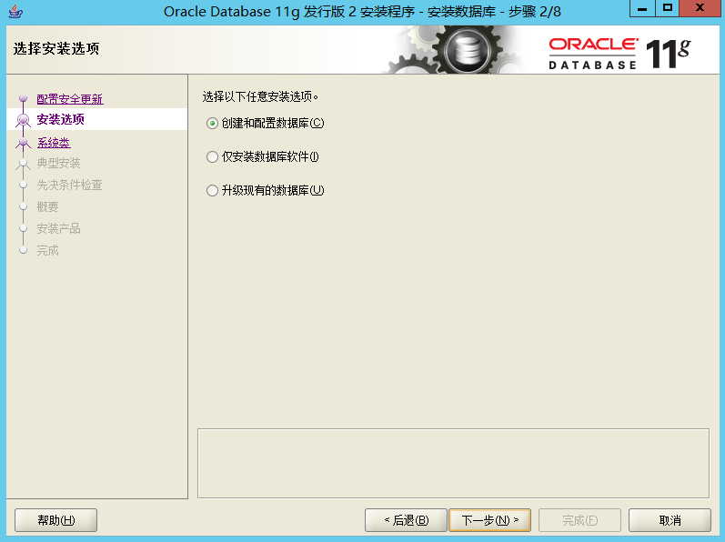
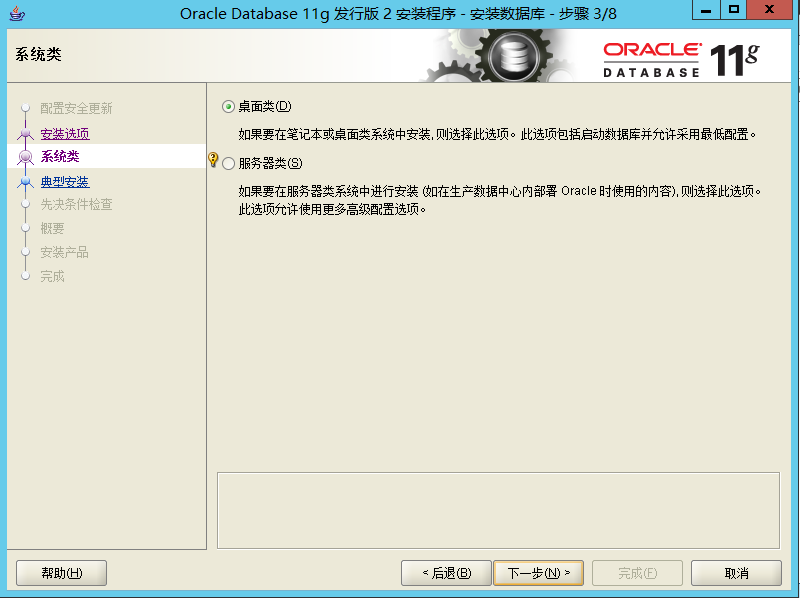
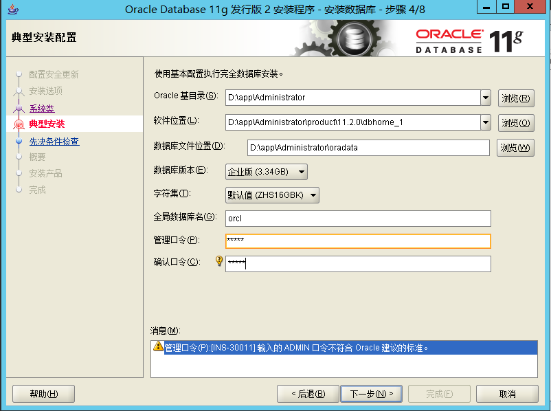
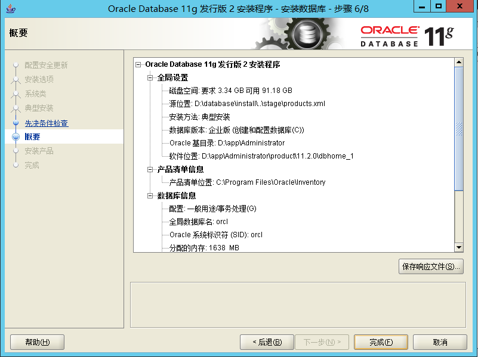
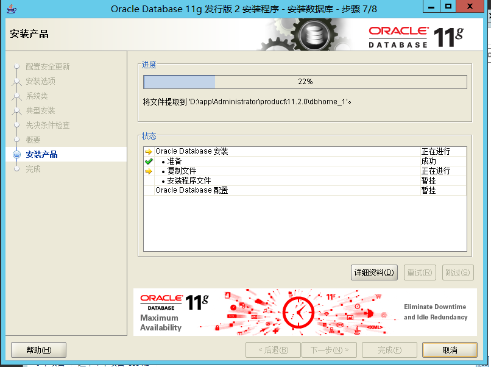
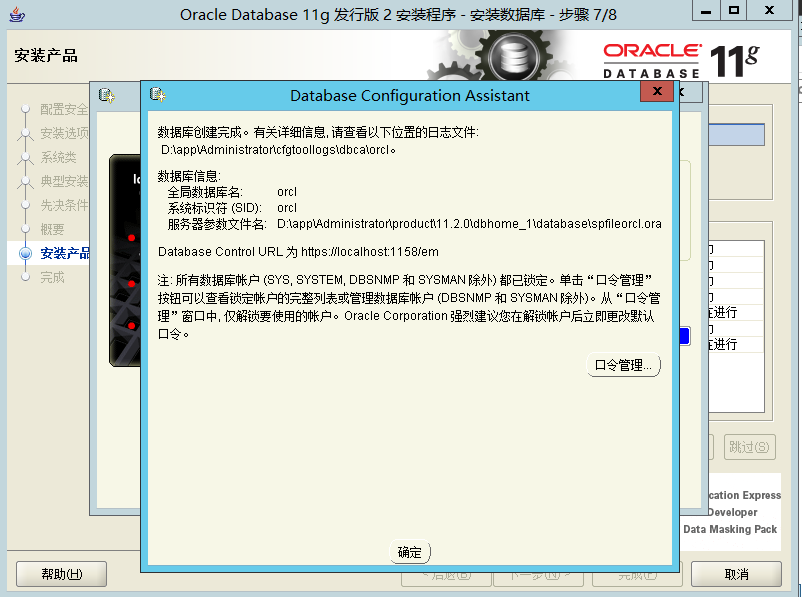

### 一、Windows下oracle数据库安装教程

准备安装包如下【已经上传至百度网盘请点击此处下载】

将这两个文件解压到当前文件夹后目录下会出现一个【database】文件夹，进入此目录后双击运行【setup.exe】进入安装程序 

双击运行后点击【是】然后依次按下面操作继续执行。。

弹框点击提示提供电子邮件提示【是】即可

提示admin口令不符合点击【是】即可

点击【完成】待跑完即可。

点击【确定】后即可。

