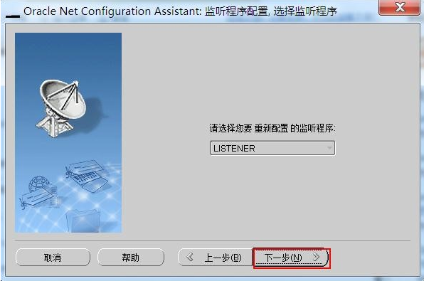
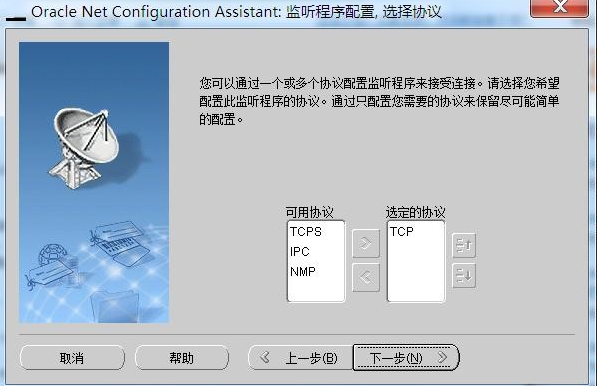
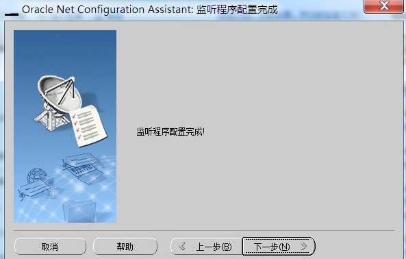

### 新装oracle数据初始配置

#### 一、开放端口

此步骤可先直接关闭防火墙测试效果。待测试通过后制定开发端口,默认为1521

#### 二、配置网络访问

配置监听程序

Windows下依次点击【开始】->【所有程序】->【ORACLE】->【配置移植工具】->【Net Configuration Assistant】配置

【监听程序配置】和 【本地网络服务名配置】











Windows下依次点击【开始】->【所有程序】->【ORACLE】->【配置移植工具】->【Net Manger】

如下图 依次点击【服务命名】->【orcl】


关闭窗口后后点击保存   

然后在客户端使用plsql连接


#### 三、默认登录方式

如果配置了登录密码则以自己配置的密码登录。


#### 四、plsql中文乱码处理

原因：本机没有配置数据库字符集环境变量，或是与数据库字符集不一致。

步骤一：在plsql中执行

```mysql
select userenv('language') from dual;
```

或是执

```msyql
select * from V$NLS_PARAMETERS;
```

两者的区别是：第一种查看到的是拼接好的一条字符集数据；第二种是查询数据库详细配置参数，有多条数据，需要以 第一行_第二行.第九行的格式拼接起来

例如：AMERICAN_AMERICA.ZHS16GBK

步骤二：在环境变量中添加配置：

NLS_LANG=AMERICAN_AMERICA.ZHS16GBK（这个value值就是我们步骤一中拼接好的那个值）

步骤三：重启plsql即可，如果没有生效，需要重启电脑。


