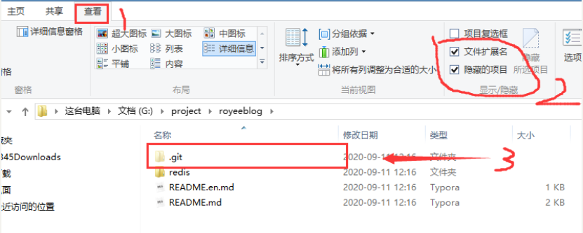
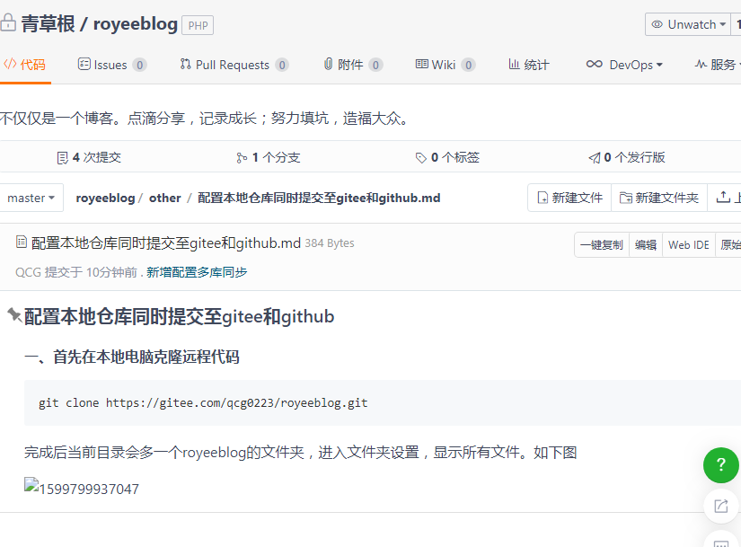
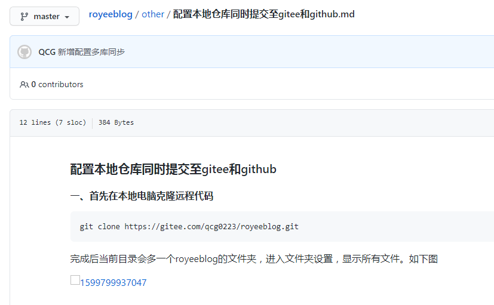

### 配置本地仓库同时提交至gitee和github

#### 一、首先在本地电脑克隆远程代码

```shell
git clone https://gitee.com/qcg0223/royeeblog.git
```

完成后当前目录会多一个royeeblog的文件夹，进入文件夹设置，显示所有文件。如下图



进入 `.git` 文件,在url位置添加其他仓库地址即可

```php
[core]
	repositoryformatversion = 0
	filemode = false
	bare = false
	logallrefupdates = true
	symlinks = false
	ignorecase = true
[remote "origin"]
	url = https://gitee.com/qcg0223/royeeblog.git
	#在url下新增另外的地址
	url = https://github.com/LogestCai/royeeblog.git
	fetch = +refs/heads/*:refs/remotes/origin/*
[branch "master"]
	remote = origin
	merge = refs/heads/master

```

保存后执行如下命令。

```sh
Administrator@XB-201902271211 MINGW64 /g/project/royeeblog (master)
$ git add .

Administrator@XB-201902271211 MINGW64 /g/project/royeeblog (master)
$ git commit -m '新增配置多库同步'
[master 7258f7d] 鏂板閰嶇疆澶氬簱鍚屾
 2 files changed, 12 insertions(+)
 create mode 100644 other/assets/1599800057514.png
 create mode 100644 "other/\351\205\215\347\275\256\346\234\254\345\234\260\344\273\223\345\272\223\345\220\214\346\227\266\346\217\220\344\272\244\350\207\263gitee\345\222\214github.md"

Administrator@XB-201902271211 MINGW64 /g/project/royeeblog (master)
$ git push
Enumerating objects: 7, done.
Counting objects: 100% (7/7), done.
Delta compression using up to 4 threads
Compressing objects: 100% (5/5), done.
Writing objects: 100% (6/6), 99.42 KiB | 19.88 MiB/s, done.
Total 6 (delta 0), reused 0 (delta 0)
remote: Powered by GITEE.COM [GNK-5.0]
To https://gitee.com/qcg0223/royeeblog.git
   93b9fa1..7258f7d  master -> master
Enumerating objects: 7, done.
Counting objects: 100% (7/7), done.
Delta compression using up to 4 threads
Compressing objects: 100% (5/5), done.
Writing objects: 100% (6/6), 99.42 KiB | 19.88 MiB/s, done.
Total 6 (delta 0), reused 0 (delta 0)
To https://github.com/LogestCai/royeeblog.git
   93b9fa1..7258f7d  master -> master

Administrator@XB-201902271211 MINGW64 /g/project/royeeblog (master)
$

```

对于首次连接的仓库会提示输入用户名和密码，按照提示输入即可。这样我们就可以看见刚刚提交的文件已经同步至gitee和github

- 效果如下





